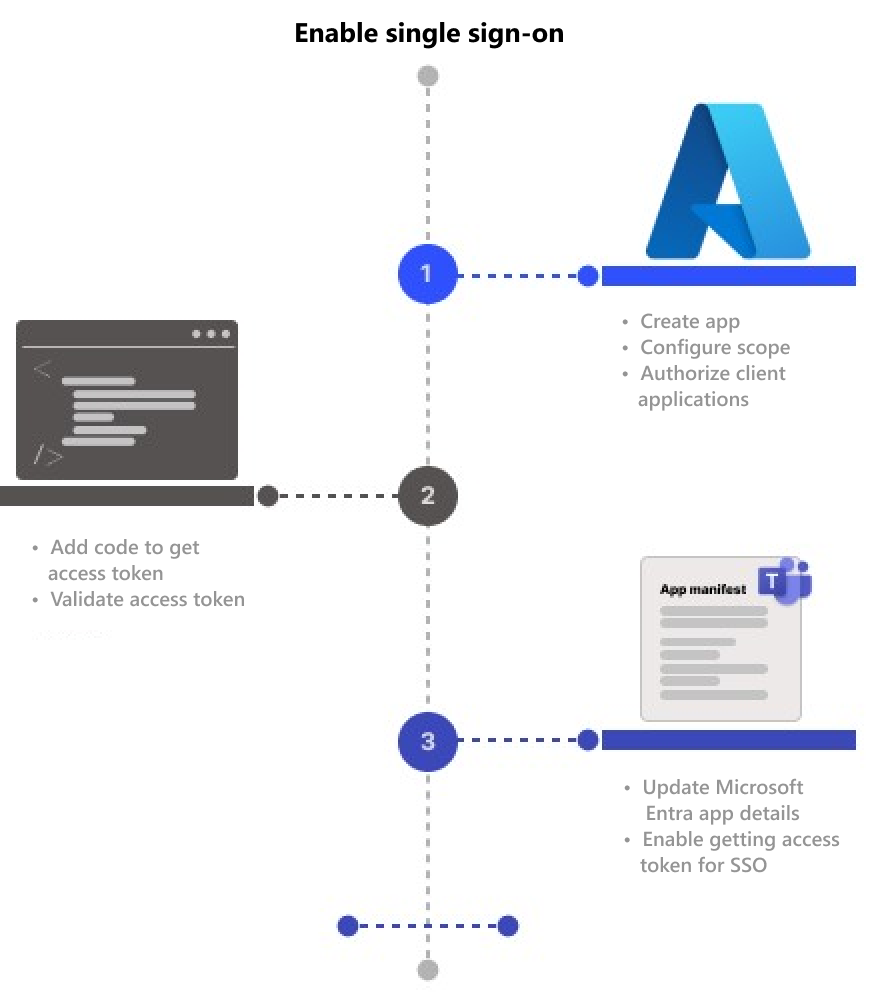
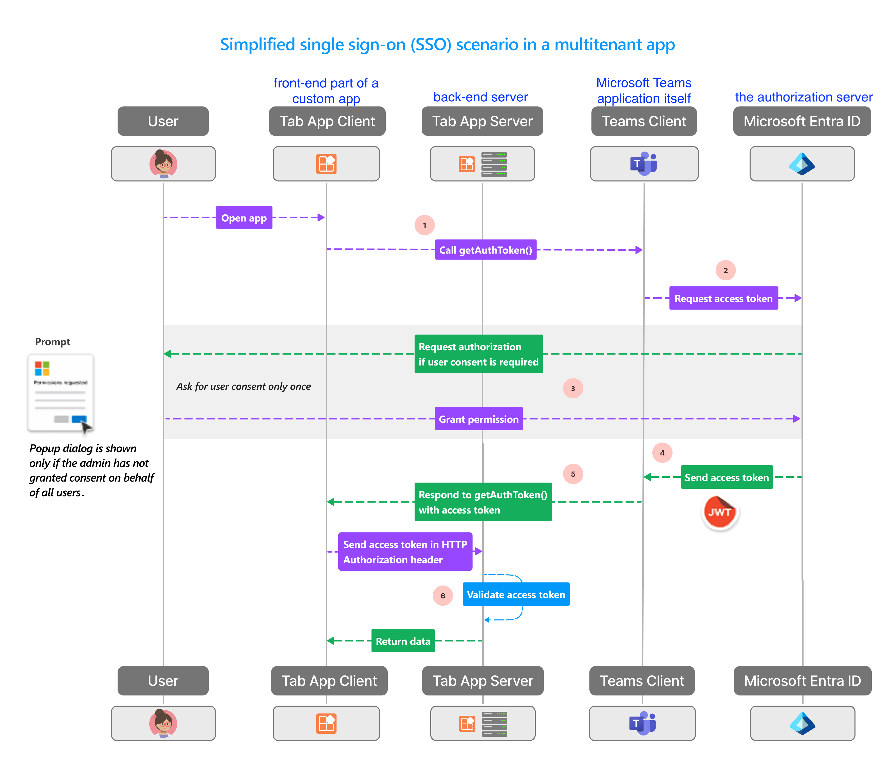

# Overview

After logging into Teams with a Microsoft or Microsoft 365 account, users can access your app without needing to sign in again.
TODO: How does this work behind the scenes? Does Teams handle the sign-in process for you?

# Enable SSO for a Teams tab app

Enabling Single Sign-On (SSO) for a Teams tab app allows users to access your app within Microsoft Teams without needing to sign in separately. When you enable SSO, **your app leverages the user's existing Teams authentication session**, automatically obtaining the necessary tokens to access Microsoft Graph or other APIs on the user's behalf.

## Configure your tab app in Microsoft Entra ID

Define the necessary permissions and API scopes. These configurations allow Microsoft Teams to access third-party data during the authentication and authorization process. By doing this, Teams application can obtain an access token on behalf of your application and the logged-in user.

1. **Expose an API**: Make your app's API accessible by Teams in this content. The Application ID URI typically follows the format: api://example.com/{AppID}. You need to put in this field yourself in the "Expose an API" section.
2. **Configure Scopes**: Define what specific actions or permissions (scopes) are allowed for your API. For example, you might allow Teams to modify certain user data on behalf of the user.
3. **Configure Authorized Client Applications**: Identify and authorize trusted client applications that you want to preauthorize for specific scopes. Add Teams application and the scope you just defined to Authorized client applications.
4. **Configure Access token version**: Inside `Manifest`, change `accessTokenAcceptedVersion` to 2.

## Add code to handle token retrieval and validation

1. Add [Teams Javascript client library](https://learn.microsoft.com/en-us/javascript/api/overview/msteams-client?view=msteams-client-js-latest#microsoft-teams-javascript-client-library)
2. Call `microsoftTeams.initialize()`. TODO: what does initialize do?
3. Call `microsoftTeams.getAuthToken()`

## Updating the Teams app manifest to enable token requests

## SSO in Teams at runtime

After configure your app to enable SSO for authenticating and authorizing app users, it can achieve SSO at runtime.

1. The front-end of the tab app makes a JavaScript call to `getAuthToken()`, which tells the Teams application to get an access token. This token is valid only for consenting to a limited set of user-level APIs, such as email, profile, offline_access, and OpenId. It’s not used for other Graph scopes like User.Read or Mail.Read.
2. The Teams application requests an access token from the Microsoft Entra endpoint (Microsoft's authentication and authorization server) based on the current user's Teams identity.
3. If the user is using your tab app for the first time, Teams will display a consent prompt.
4. Microsoft Entra ID sends the access token (JWT) to the Teams Client. Teams caches the token on your behalf so that future calls to `getAuthToken()` return the cached token.
5. The Teams application sends the access token to the front-end of the tab app as part of the result from the `getAuthToken()` call.
6. The tab app parses the access token using JavaScript to extract required information.

When a custom app is integrated into Microsoft Teams, the Teams application essentially acts as a wrapper around the front-end of that custom app.

## Enable SSO in Microsoft Entra ID
What is the difference between enable SSO for a team tab app and in microsoft entra ID

**Microsoft Entra ID (formerly Azure Active Directory (Azure AD))**
: a service from Microsoft that helps organizations manage user identities and control access to resources like apps, services, and data.

## Difference between SSO and OAuth
**SSO**
: SSO allows users to log in once and gain access to multiple, related systems without needing to log in separately to each one. For example, logging into your Google account gives you access to Gmail, Google Drive, YouTube, etc., without requiring separate logins for each service.

**OAuth (Open Authorization)**
: OAuth is a protocol that allows third-party applications to access a user's resources. For example, a third-party app can access your Google Drive files after you grant permission, without needing your Google password. OAuth can be used as part of an SSO system.

# Update app manifest for SSO and preview app

# Grant Microsoft Graph permissions and scopes
